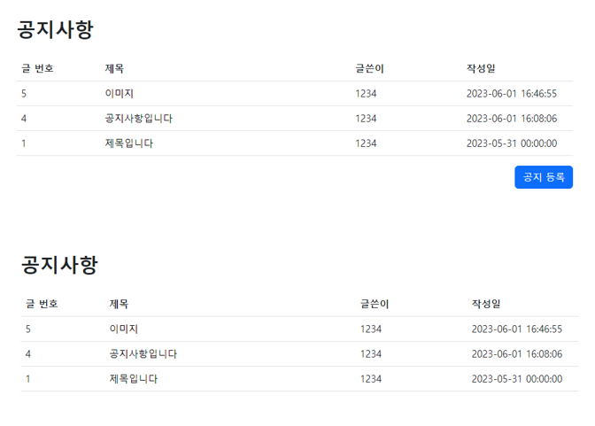
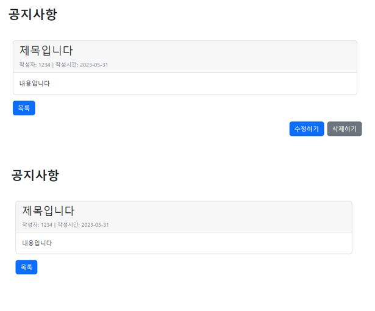
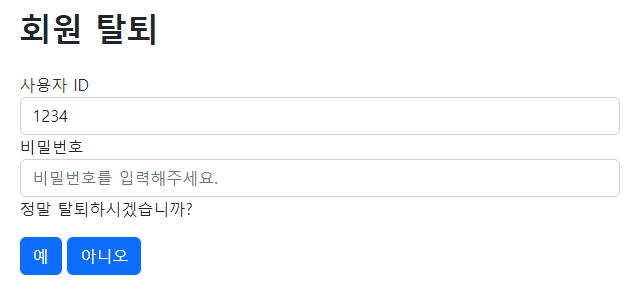
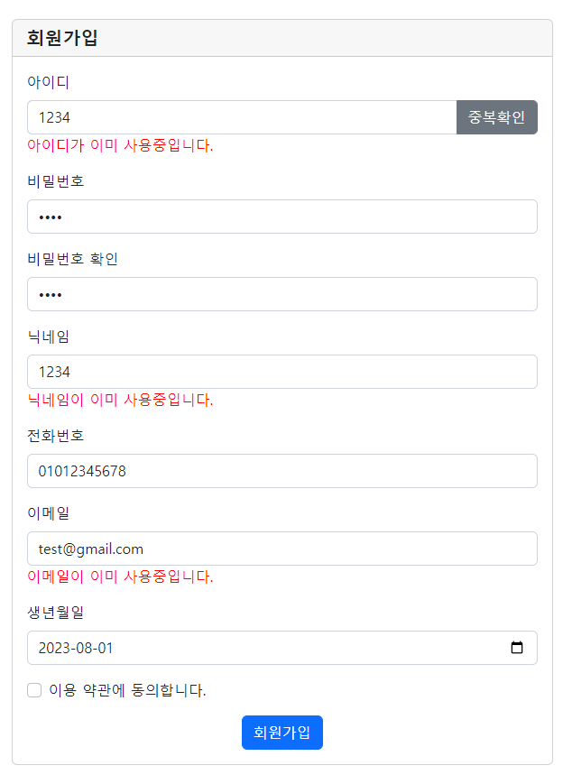
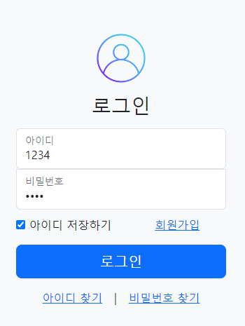
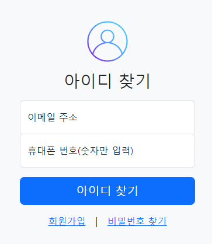
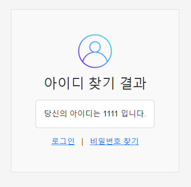
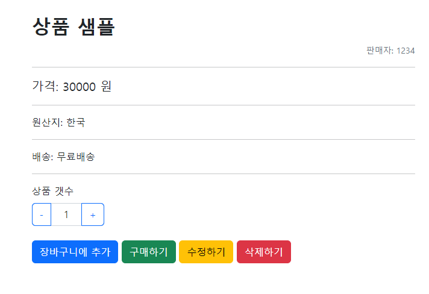

# 5일장 마켓

###프로젝트 소개
---
개인거래 사이트 '5일장'은 Java와 Spring을 토대로 제작하였습니다.

추가적으로 JSP ,JSTL, Ajax, HTML, CSS, JavaScript를 사용해서 구현했습니다.

개인이 사용하지 않는 새 물건이나 중고물품들을 거래할 수 있는 사이트를 목표했습니다.

형식은 쇼핑몰의 형식을 띄고 있으나, 사업자가 아닌 개인회원이 가입해서 구매, 판매하는 구성입니다.

##프로젝트 진행기간
---
2023.07-04 ~ 2023.07.13

###개발환경
---
OS : Windows 10

FW : Spring Framework

DB : Oracle11c

WAS : Apache Tomcat 9.0

Front-end : HTML5 / CSS / javascript / jQuery / AJAX / JSON

Back-end : JDK 1.8 / JSP / JSTL / Mybatis

Developer Tools : STS 3.9.12 / eXERD / SqlDeveloper

GitHub

###주요기능
---
공지사항 CRUD

개인회원 CRUD

상품 CRUD

로그인

아이디, 비밀번호 찾기

회원가입 

###상세 기능 설명
---
##공지사항

권한이 있는경우에만 공지 등록을 할 수 있는 버튼이 활성화 된다.

수정과 삭제 역시 권한이 있는 계정만 버튼이 활성화 된다.

## 개인정보 관리
회원정보 수정을 하기 위해서는 비밀번호를 확인 후 수정할 수 있다.

회원 탈퇴를 하기 위해서는 비밀번호를 확인 후 탈퇴할 수 있다.

##회원가입
아이디의 경우 버튼을 통해 중복을 체크하도록 되어있다.
닉네임과 이메일은 즉시 중복인지를 확인한다.

##로그인

#아이디 찾기
아이디의 경우 이메일과 휴대폰번호로 확인 후 바로 확인이 가능하다.

#비밀번호 찾기
비밀번호의 경우 등록된 이메일로 변경 메일이 가서 수정하도록 되어있다.

##상품
상품등록은 권한을 가진 계정만 가능하다

등록된 상품 수정, 삭제의 경우 자신의 아이디인 경우만 가능하다

 

###ERD
---

